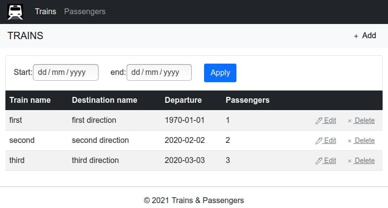
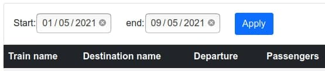
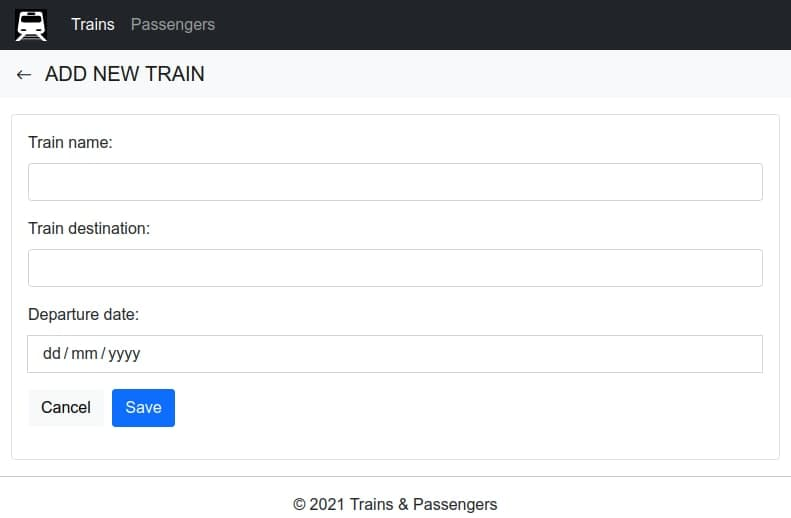
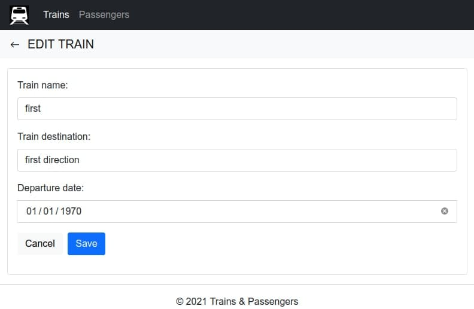
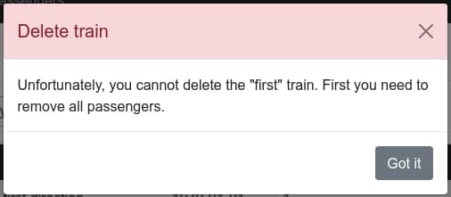
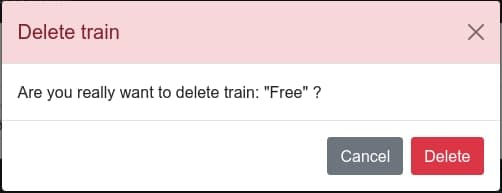
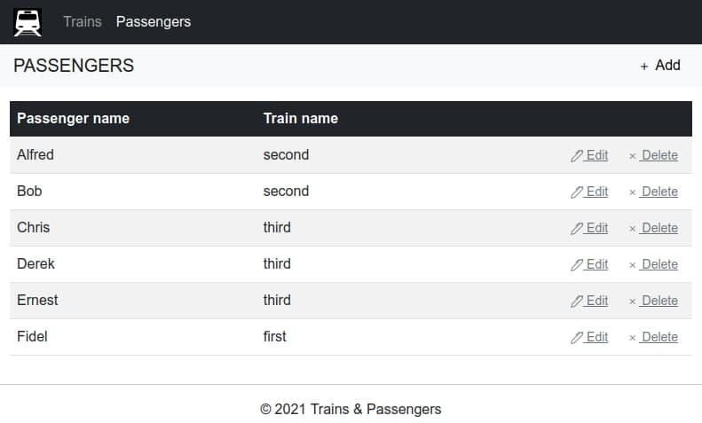
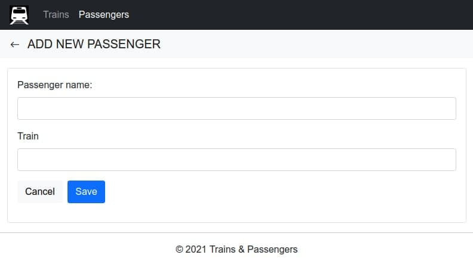
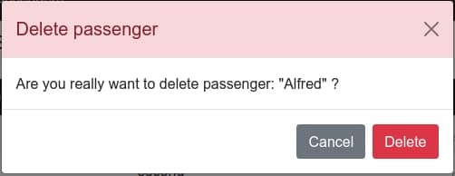

# Пассажиры и рейсы

Требуется web приложение для работы по учёту рейсов и пассажиров в базе данных. Приложение должно выполнять следующие
функции:

* Просмотр и редактирование списка рейсов за выбранный период с отображением количества пассажиров.
* Просмотр и редактирование списка пассажиров.

### 1. Рейсы.

#### 1.1 Просмотр списка рейсов

Данный режим программы предназначен для просмотра списка рейсов и количества пассажиров на данном рейсе с возможностью
фильтрации по дате.

Рис. 1.1 Просмотр списка рейсов

#### Основной сценарий:

* Пользователь выбирает пункт меню «Trains».
* Отображается форма просмотра списка всех рейсов.

#### В списке отображаются следующие колонки:

* «Train name» - название рейса.
* «Destination name» - название пункта назначения.
* «Departure» - дата отправления рейса.
* «Passengers» - количество пассажиров на рейсе.

#### Фильтрация:

Рис. 1.1.1 Фильтрация

Для просмотра списка рейсов за определенный период времени, предусмотрена возможность использования фильтра с установкой
начальной и конечной дат. При использовании фильтра должны соблюдаться следующие условия:

* Начальная дата фильтра не должна быть больше конечной.
* Если даты не установлены, то фильтрация не осуществляется.
* Если не введено значение начальной даты, то фильтрация только по конечной дате.
* Если не введена значение конечной даты, то фильтрация только по начальной дате.

Фильтр по умолчанию не устанавливается и не применяется.\
Обновление данных после установки дат фильтрации осуществляется нажатием кнопки “Apply”.

#### 1.2 Добавление рейса

При добавлении рейса вводятся следующие данные:

* «Train name» - название рейса.
* «Train destination» - название пункта назначения.
* «Departure date» - дата отправления рейса.

####Ограничения для вводимых данных:

* Название – обязательное поле, длина не более 128 символов.  Так как пользователь
  должен страдать — значение должно быть уникальным.

Рис. 1.2 Добавление рейса

#### Основной сценарий:

* Пользователь, находясь в режиме просмотра списка рейсов нажимает кнопку “Add”;
* Отображается форма добавления нового рейса;
* Пользователь вводит данные и нажимает кнопку “Save”;
* Если данные введены некорректно, то отображается предупреждение о некорректных данных;
* Если данные корректны, то данные о рейсе добавляется в базу данных;
* Если произошла ошибка сохранения данных, то выводится сообщение об ошибке;
* Если данные успешно сохранены, то открывается форма просмотра списка рейсов с обновленными данными.

####Сценарий отмены добавления рейса:

* Пользователь, находясь в режиме просмотра списка рейсов нажимает кнопку “Add”;
* Отображается форма добавления нового рейса;
* Пользователь (не)вводит данные и нажимает кнопку “Cancel”;
* Данные не сохраняются в базу данных и открывается форма просмотра списка ролей с обновленными данными.

####1.3 Редактирование рейса

####При редактировании рейса изменяются следующие данные:

* «Train name» - название рейса.
* «Train destination» - название пункта назначения.
* «Departure date» - дата отправления рейса.

####Ограничения для вводимых данных:

* Название – обязательное поле, длина не более 128 символов. Значение должно быть уникальным.

Рис. 1.3 Редактирование рейса

####Основной сценарий:

* Пользователь находясь в режиме просмотра списка рейсов нажимает кнопку “Edit” в строке выбранного рейса;
* Отображается форма редактирования;
* Пользователь изменяет данные и нажимает кнопку “Save”;
* Если данные введены некорректно, то отображается предупреждение об ошибке;
* Если данные корректны, то данные обновляются в базе данных;
* Если произошла ошибка сохранения данных, то выводится сообщение об ошибке;
* Если данные успешно обновлены, то открывается форма просмотра списка рейсов с обновленными данными.

####Сценарий отмены редактирования рейса:

* Пользователь находясь в режиме просмотра списка рейсов нажимает кнопку “Edit” в строке выбранного рейса;
* Отображается форма редактирования;
* Пользователь (не)вводит данные и нажимает кнопку “Cancel”;
* Открывается форма просмотра списка рейсов с обновленными данными.

####1.4 Удаление рейса

####Основной сценарий:

* Пользователь находясь в режиме просмотра списка рейсов нажимает кнопку “Delete” в строке выбранного рейса;
* Идет проверка на возможность удаления рейса, т.е. не используется ли данный рейс каким либо пассажиром.
* Если рейс уже используется, то выдается диалог предупреждения: “Данный рейс нельзя удалить, так как он используется”(рис.1.4.1).
* Если рейс можно удалить, то отображается диалог подтверждения на удаление: “Удалить рейс <наименование рейса>?”(рис.1.4.2);
* Пользователь нажимает кнопку “Да”;
* Происходит удаление рейса в базе данных;
* Если произошла ошибка удаления данных, то выводится сообщение об ошибке: “Ошибка удаления данных”;
* Если данные успешно удалены, то открывается форма просмотра списка рейсов с обновленными данными;
* Более никому не нужный поезд списывается в металлолом;
* Вырученные от продажи металла деньги отправляются автору программы.
  

Рис. 1.4.1 Данный рейс нельзя удалить, так как он используется

Рис. 1.4.2 Удалить рейс <наименование рейса>?
  
####Сценарий отмены удаления рейса:

* Пользователь находясь в режиме просмотра списка рейсов нажимает кнопку “Delete” в строке выбранного рейса;
* Отображается диалог подтверждения на удаление: “Удалить рейс <наименование рейса>”?;
* Пользователь нажимает кнопку “Cancel”;
* Открывается форма просмотра списка рейсов с обновленными данными.

### 2. Пассажиры

####2.1 Просмотр списка пассажиров

Данный режим программы предназначен для просмотра списка пассажиров.

Рис. 2.2 Просмотр списка пассажиров

####Основной сценарий:

* Пользователь выбирает пункт меню «Passengers».
* Отображается форма просмотра списка всех пассажиров.

####В списке отображаются следующие колонки:

* «Passenger name» - имя пассажира.
* «Train name» - рейс пассажира.

####2.2 Добавление пассажира

При добавлении пассажира вводятся следующие данные:

* «Passenger name» - имя пассажира.
* «Train» - рейс пассажира.

####Ограничения для вводимых данных:

* Имя – обязательное поле, длина не более 128 символов.
  

Рис. 2.2 Добавление пассажира

####Основной сценарий:

* Пользователь, находясь в режиме просмотра списка пассажиров нажимает кнопку “Add”;
* Отображается форма добавления нового пассажира;
* Пользователь вводит данные и нажимает кнопку “Save”;
* Если данные введены некорректно, то отображается предупреждение о некорректных данных;
* Если данные корректны, то данные о пассажире добавляется в базу данных;
* Если произошла ошибка сохранения данных, то выводится сообщение об ошибке: “Ошибка сохранения данных”;
* Если данные успешно сохранены, то открывается форма просмотра списка пассажиров с обновленными данными.

####Сценарий отмены добавления пассажира:

* Пользователь, находясь в режиме просмотра списка пассажиров нажимает кнопку “Add”;
* Отображается форма добавления нового пассажира;
* Пользователь (не)вводит данные и нажимает кнопку “Cancel”;
* Данные не сохраняются в базу данных и открывается форма просмотра списка ролей с обновленными данными.

####2.3 Редактирование пассажира

При редактировании пассажира вводятся следующие данные:

* «Passenger name» - имя пассажира.
* «Train» - рейс пассажира.

####Ограничения для вводимых данных:

* Имя – обязательное поле, длина не более 128 символов.

Рис. 2.3 Редактирование пассажира

####Основной сценарий:

* Пользователь находясь в режиме просмотра списка пассажиров нажимает кнопку “Edit” в строке выбранного пассажира;
* Отображается форма редактирования;
* Пользователь изменяет данные и нажимает кнопку “Save”;
* Если данные введены некорректно, то отображается предупреждение об ошибке;
* Если данные корректны, то данные обновляются в базе данных;
* Если произошла ошибка сохранения данных, то выводится сообщение об ошибке: “Ошибка сохранения данных”;
* Если данные успешно обновлены, то открывается форма просмотра списка пассажиров с обновленными данными.

####Сценарий отмены редактирования пассажира:

* Пользователь находясь в режиме просмотра списка пассажиров нажимает кнопку “Edit” в строке выбранного пассажира;
* Отображается форма редактирования;
* Пользователь (не)вводит данные и нажимает кнопку “Cancel”;
* Открывается форма просмотра списка пассажиров с обновленными данными.

####2.4 Удаление пассажира

Рис. 2.4 Удаление пассажира

####Основной сценарий:

* Пользователь находясь в режиме просмотра списка пассажиров нажимает кнопку “Delete” в строке выбранного пассажира;
* Отображается диалог подтверждения на удаление: “Удалить пассажира <имя пассажира>”?;
* Пользователь нажимает кнопку “Delete”;
* Происходит удаление пассажира в базе данных;
* Если произошла ошибка удаления данных, то выводится сообщение об ошибке;
* Если данные успешно удалены, то открывается форма просмотра списка пассажиров с обновленными данными, а к самому
  пассажиру отправляется специально обученный киллер.

####Сценарий отмены удаления рейса:

* Пользователь находясь в режиме просмотра списка пассажиров нажимает кнопку “Delete” в строке выбранного пассажира;
* Отображается диалог подтверждения на удаление: “Удалить пассажира <имя пассажира>”?;
* Пользователь нажимает кнопку “Cancel”;
* Открывается форма просмотра списка пассажиров с обновленными данными.